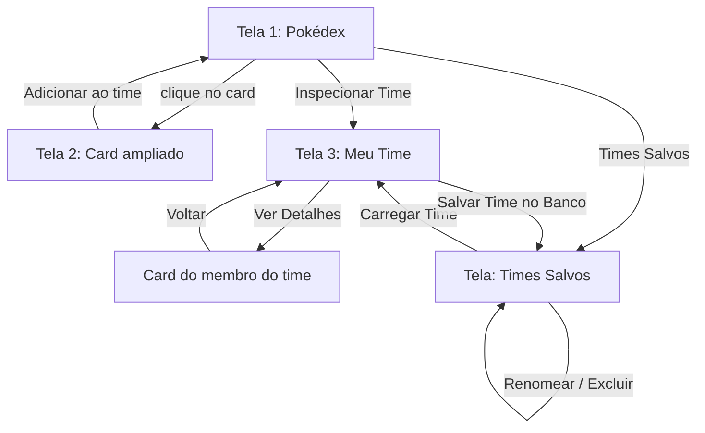

# Módulo de Interface Gráfica (JavaFX) — Pokédex & Team Builder

**Responsável:** Guilherme Filho — Desenvolvedor Frontend
**Classe principal:** `AppPokedex.java`
**Papel no projeto:** Camada de visão e interação, responsável por transformar os dados vindos dos repositórios (`PokemonRepository`, `GolpeRepository`, `NatureRepository`, `EquipeRepository`, `MembroTimeRepository`) em telas navegáveis, sem executar nenhuma lógica de acesso a banco diretamente.

---

## 1. Contexto: resposta ao feedback da Etapa 1

Na primeira etapa de avaliação, o grupo (G10) e a parte individual de frontend receberam nota 5,2/10, com críticas específicas que este módulo busca resolver diretamente. Abaixo, cada crítica é mapeada para o que foi implementado desde então:

| Crítica recebida (Etapa 1) | Situação atual em `AppPokedex.java` |
| :--- | :--- |
| *"Sem controladores ou componentes de visão implementados, a aplicação não roda"* | A aplicação agora é funcional de ponta a ponta: inicializa o banco, carrega repositórios e renderiza 3 telas navegáveis (Pokédex, Detalhe do Pokémon, Meu Time), todas interligadas por eventos reais de clique. |
| *"Arquivos fxml sem configuração de controladores"* | Optamos por abandonar o fluxo FXML + Controller separado e construir a interface **100% programaticamente em Java** (JavaFX puro, sem `.fxml`). Isso elimina a fonte do problema anterior — não há mais a dependência de vincular `fx:controller` a um arquivo `.fxml`, já que a própria classe `AppPokedex` monta e conecta os componentes visuais diretamente via código. |
| *"Foco excessivo em base de dados, sem avançar em outras áreas como interface gráfica e código MVC"* | O frontend evoluiu para uma aplicação completa com 3 telas, navegação entre elas, formulários (`ChoiceDialog`, `TextInputDialog`), feedback visual (`Alert`) e componentes dinâmicos (`ProgressBar` para stats). |
| *"Não há evidências de validação das interfaces criadas"* | Foram implementadas validações de fluxo real: impedir adicionar um 5º Pokémon ao time, impedir salvar time vazio, impedir salvar com nome em branco, e tratamento de listas vazias (ex: "Você ainda não tem nenhum time salvo"). |
| *"Seria bom levantar sistemas semelhantes para saber o quanto é inovador"* | Ver Seção 4 — comparação direta com a **PokeAPI**, destacando o que o nosso projeto oferece a mais. |
| *"README praticamente vazio"* | Este documento. |

---

## 2. Arquitetura da classe `AppPokedex`

`AppPokedex` estende `javafx.application.Application` e atua como a única classe de interface do projeto. Ela **não contém nenhuma instrução SQL**: toda persistência é delegada aos repositórios, seguindo o padrão Repository já adotado no restante do projeto (`EquipeRepository`, `MembroTimeRepository`, etc.).

A tela é organizada em um único `BorderPane` (`root`), cujo centro (e topo, quando necessário) é substituído dinamicamente conforme o usuário navega — não há troca de `Stage` ou `Scene`, apenas troca de conteúdo, o que deixa a navegação mais leve e fluida.

---

## 3. Principais métodos e funcionalidades

### Inicialização
- **`start(Stage stage)`** — ponto de entrada JavaFX. Cria a conexão com o banco (`Database`), instancia todos os repositórios e monta a tela inicial (Pokédex).

### Tela 1 — Pokédex (consulta)
- **`mostrarPokedex()`** — monta a barra superior (campo de busca, botão de pesquisa, filtro por tipo, botão "Times Salvos" e "Inspecionar Time") e carrega a grade inicial com todos os Pokémon.
- **`gradeDeCards(List<Pokemon>)`** — transforma uma lista de `Pokemon` em um `FlowPane` responsivo, que quebra linha automaticamente conforme o tamanho da janela.
- **`criarCard(Pokemon p)`** — monta o card individual (sprite + nome) e associa o clique à abertura da tela de detalhes.

### Tela 2 — Detalhe do Pokémon
- **`mostrarCard(Pokemon p)`** — exibe sprite ampliado, os 6 stats base (via barras de progresso coloridas), o golpe padrão e a lista de fraquezas/resistências, calculada a partir da tabela de efetividade de tipos.
- **`criarBarraStatus(String, int)`** — gera uma `ProgressBar` cuja cor muda dinamicamente conforme o valor do status (vermelho → laranja → amarelo → verde).
- **`adicionarAoTime(Pokemon p)`** — valida o limite de 4 integrantes e adiciona o Pokémon ao time em memória.

### Tela 3 — Meu Time (montagem em memória)
- **`mostrarTime()`** — exibe os integrantes atuais do time (0 a 4), com opção de salvar o time no banco.
- **`linhaTime(MembroTime)`** — monta cada linha do time com botões para ver detalhes, trocar nature, trocar ataque ou remover o Pokémon.
- **`alterarNature(MembroTime)`** / **`alterarAtaque(MembroTime)`** — abrem um `ChoiceDialog` para escolher, respectivamente, a nature ou o golpe do Pokémon dentro do time, sem alterar o Pokémon "base" da Pokédex.
- **`criarBarraStatusNature(...)`** — recalcula os stats aplicando o efeito da nature escolhida (+10% no status favorecido, -10% no prejudicado), com indicação visual (↑ verde / ↓ vermelho).
- **`mostrarCardTime(MembroTime)`** — versão do card ampliado específica para um membro do time, já mostrando os stats ajustados pela nature e o golpe escolhido.

### Persistência de times (CRUD via repositórios)
- **`salvarTimeAtual()`** — persiste o time atual: cria um registro `Equipe` (via `EquipeRepository.create`) e, para cada Pokémon do time, cria um `MembroTime` vinculado (via `MembroTimeRepository.create`).
- **`mostrarTimesSalvos()`** — lista todas as equipes salvas no banco (`EquipeRepository.loadAll()`).
- **`linhaEquipeSalva(Equipe)`** — monta a linha de cada time salvo, buscando seus membros (`MembroTimeRepository.loadByEquipe`) para exibir os nomes dos Pokémon.
- **`carregarEquipe(Equipe)`** — carrega um time salvo do banco de volta para a memória (`time`), permitindo continuar editando.
- **`excluirEquipe(Equipe)`** — remove primeiro os membros e depois a equipe, evitando registros órfãos no banco.
- **`renomearEquipe(Equipe, Label)`** — atualiza o nome de uma equipe já salva (`EquipeRepository.update`).

---

## 4. Diferencial em relação à PokeAPI

A [PokeAPI](https://pokeapi.co/) é uma referência amplamente usada no ecossistema Pokémon, mas seu escopo é limitado: trata-se de uma **API REST pública somente leitura**, que devolve dados brutos (stats, tipos, sprites, movimentos) em JSON, sem qualquer camada de aplicação, interface ou persistência de dados do usuário.

Nosso projeto se posiciona um passo além:

| Aspecto | PokeAPI | Pokédex & Team Builder (este projeto) |
| :--- | :--- | :--- |
| Consulta de dados (stats, tipos, sprites) | ✅ Sim | ✅ Sim (via base local SQLite) |
| Interface gráfica pronta para uso | ❌ Não (apenas dados brutos) | ✅ Sim (desktop, JavaFX) |
| Persistência de times personalizados | ❌ Não existe conceito de "usuário" | ✅ CRUD completo de equipes (salvar, carregar, renomear, excluir) |
| Simulação de Natures alterando stats | ❌ Não | ✅ Sim, com recálculo automático (+10%/-10%) e indicação visual |
| Escolha de golpe por Pokémon dentro do time | ❌ Não | ✅ Sim, editável por membro do time |
| Funciona offline | ❌ Não (depende de requisição HTTP) | ✅ Sim (banco SQLite local) |

Ou seja: enquanto a PokeAPI resolve o problema de *fornecer dados*, este projeto resolve o problema de *usar esses dados para tomar decisões de build* — o usuário não só consulta um Pokémon, mas monta, testa e guarda combinações de nature/golpe pensando em maximizar os stats do time, algo mais próximo de ferramentas de simulação competitiva do que de um simples visualizador de dados.

---

