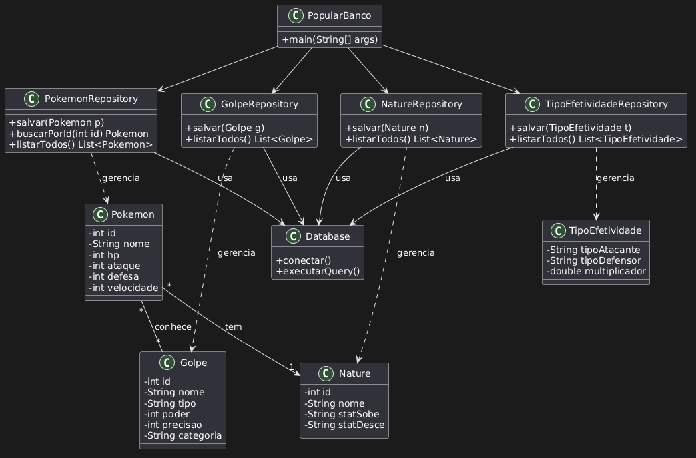

# Relatório — Modelagem UML do Projeto Pokédex

## 1. Objetivo

Este relatório documenta o processo de modelagem do diagrama de classes (UML)
do projeto, construído a partir do código já implementado na pasta
`BancoDeDados` do repositório. O diagrama representa tanto as **entidades do
domínio** (Pokémon, Golpe, Nature e Tipo de Efetividade) quanto a **camada de
persistência** responsável por gravar e ler esses dados no banco.

## 2. Estrutura do projeto

Analisando os arquivos do repositório, o sistema se divide em duas camadas:

**Entidades (modelo de domínio)** — representam os dados do jogo:

- `Pokemon` — o Pokémon em si, com seus atributos de status.
- `Golpe` — os golpes/movimentos que um Pokémon pode conhecer.
- `Nature` — a natureza do Pokémon (qual atributo é favorecido/prejudicado).
- `TipoEfetividade` — a tabela de efetividade entre tipos.

**Camada de persistência (padrão Repository)** — cuida do banco de dados:

- `Database` — responsável pela conexão e execução de queries no banco.
- `PokemonRepository`, `GolpeRepository`, `NatureRepository`,
  `TipoEfetividadeRepository` — cada um faz o CRUD (salvar, buscar, listar) de
  uma entidade.
- `PopularBanco` — classe com o `main`, que lê os arquivos CSV
  (`pokemons.csv`, `golpes.csv`, `pokemon_golpes.csv`) e usa os repositórios
  para popular o banco com os dados iniciais.

## 3. Ferramenta utilizada

A modelagem foi feita no **PlantUML**, uma linguagem de marcação que gera o
diagrama a partir de texto. O código-fonte do diagrama (`@startuml ... @enduml`)
foi escrito no editor web do PlantUML, que renderiza a imagem em tempo real.

Dois arquivos foram produzidos e versionados no repositório:

- `diagrama.puml` — o código-fonte do diagrama (editável).
- `UML.png` — a imagem renderizada (exportada pela opção **PNG** do PlantUML).

## 4. As classes e seus atributos

|Classe           |Atributos principais                                  |
|-----------------|------------------------------------------------------|
|`Pokemon`        |`id`, `nome`, `hp`, `ataque`, `defesa`, `velocidade`  |
|`Golpe`          |`id`, `nome`, `tipo`, `poder`, `precisao`, `categoria`|
|`Nature`         |`id`, `nome`, `statSobe`, `statDesce`                 |
|`TipoEfetividade`|`tipoAtacante`, `tipoDefensor`, `multiplicador`       |

Uma decisão importante da modelagem: atributos como `hp`, `defesa` e
`velocidade` são valores numéricos simples (`int`), por isso ficam **dentro**
da classe `Pokemon`. Já `Golpe` e `Nature` não são valores únicos — cada um
carrega vários dados próprios (nome, tipo, poder, etc.), por isso viraram
**classes separadas**, e não simples atributos. A regra usada foi: *se a coisa
precisa de mais de um campo para ser descrita, ela vira uma classe.*

## 5. As relações e a lógica de cada uma

### 5.1 Relações de domínio (entre as entidades)

**Pokemon `*` — `*` Golpe (conhece)** — relação **muitos-para-muitos**. Um
Pokémon conhece vários golpes, e o mesmo golpe (ex.: “Thunderbolt”) pode ser
conhecido por vários Pokémon. É uma associação simples, sem posse exclusiva —
nenhum dos dois “é dono” do outro. Essa relação é exatamente o que o arquivo
`pokemon_golpes.csv` materializa: uma tabela de junção ligando os dois.

**Pokemon `*` → `1` Nature (tem)** — cada Pokémon **tem uma** natureza, e a
mesma natureza serve para vários Pokémon. A natureza existe de forma
independente (não deixa de existir se um Pokémon for removido), portanto é uma
associação, não composição.

**TipoEfetividade** — fica como uma tabela de dados independente. Como o projeto
**não possui sistema de ataque/batalha**, nenhuma classe consulta a efetividade
para calcular dano; ela é apenas armazenada e listada como cadastro.

### 5.2 Relações de persistência (padrão Repository)

**XRepository → Database (usa)** — cada repositório **usa** o `Database` para
executar suas operações (conectar e rodar as queries). É uma dependência: o
repositório não herda nem possui o banco, apenas recorre a ele para trabalhar.

**XRepository ⇢ Entidade (gerencia)** — representada por linha tracejada
(dependência). O repositório **manipula** objetos da sua entidade: recebe-os
como parâmetro (`salvar`) e os devolve como retorno (`buscarPorId`,
`listarTodos`). Importante: o repositório não *é* a entidade nem a guarda como
atributo permanente — ele apenas trabalha com ela. Essa é a diferença entre
**usar** uma classe e **herdar** dela.

**PopularBanco → Repositories** — o `PopularBanco` orquestra a carga inicial:
chama cada repositório para inserir no banco os dados lidos dos CSVs. Por isso
aponta para todos os quatro repositórios.

## 6. Fluxo de funcionamento

O caminho dos dados no sistema é:

1. `PopularBanco` lê os arquivos CSV (`pokemons.csv`, `golpes.csv`,
   `pokemon_golpes.csv`).
1. Para cada registro, chama o repositório correspondente
   (`PokemonRepository`, `GolpeRepository`, etc.).
1. Cada repositório usa o `Database` para gravar os dados no banco.
1. Posteriormente, os mesmos repositórios são usados para **ler** os dados
   (buscar/listar), devolvendo objetos das entidades para o restante do
   programa.

Em resumo: as entidades são os objetos que circulam pela “tubulação”; os
repositórios são as válvulas que controlam a entrada e saída; e o `Database` é
a conexão final com o banco.

## 7. Observação sobre o tipo de relações

A arquitetura segue o **padrão Repository**, que por natureza se apoia em
relações de **associação** e **dependência** (uma camada usa a outra), e não em
herança ou composição. Isso é coerente com um sistema voltado a cadastro e
persistência de dados, sem lógica de comportamento complexa entre as entidades.

## 8. Diagrama gerado

## 9. Versionamento

Os artefatos da modelagem foram adicionados ao repositório via GitHub:

- `UML.png` — diagrama renderizado, enviado por **Add file → Upload files**.
- `diagrama.puml` — código-fonte do diagrama, criado via
  **Add file → Create new file**.

Dessa forma, o diagrama fica disponível tanto como imagem (visualização direta
no repositório) quanto como fonte editável, permitindo ajustes futuros sem
precisar refazer todo o desenho.